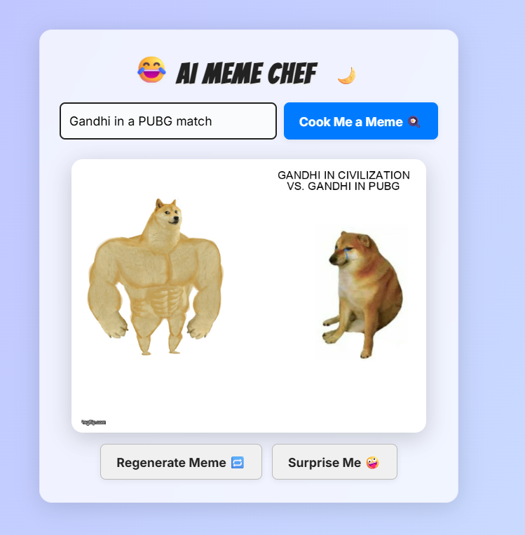
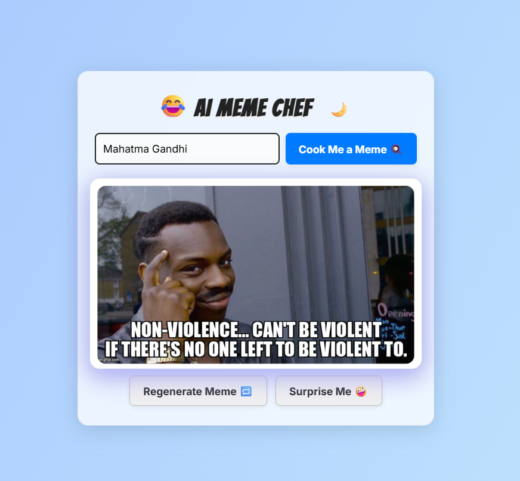
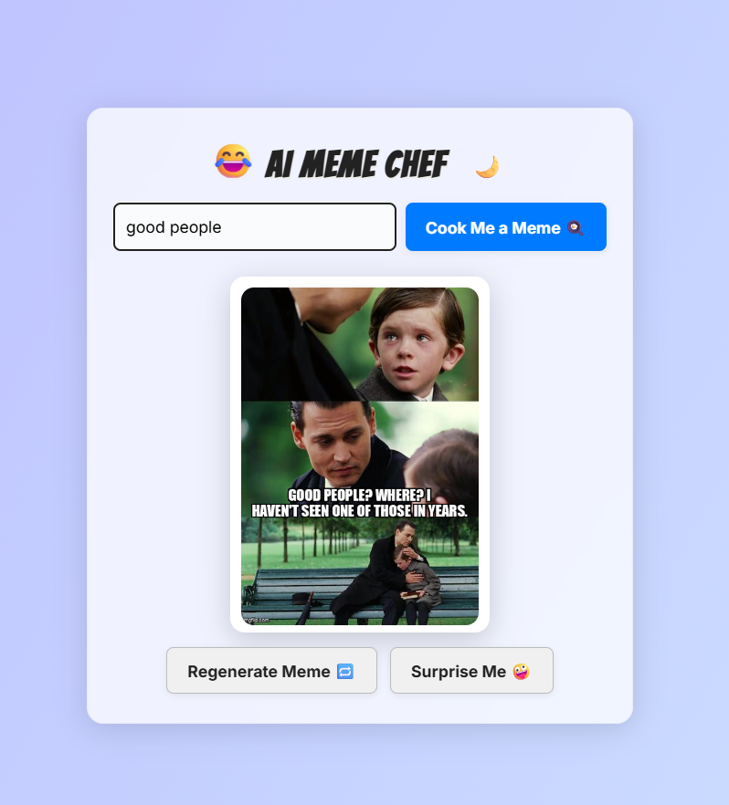
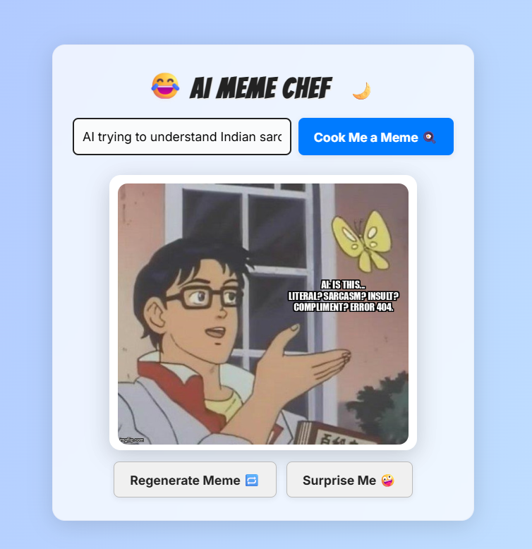
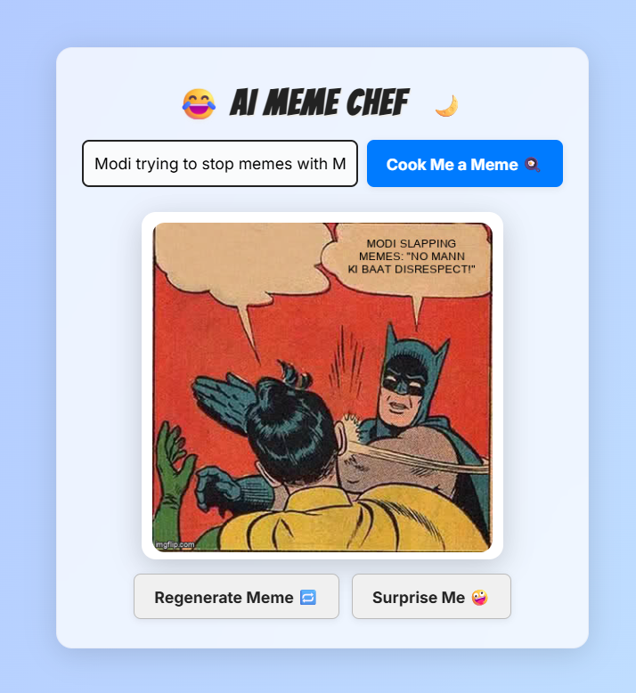

# 🤣 AI Meme Chef

A modern, viral-ready meme generator web app powered by Google Gemini and Imgflip. Enter any topic and cook up a fresh, punchy meme in seconds!

---

## 🚀 Live Demo
[https://meme-generator-8486.onrender.com](https://meme-generator-8486.onrender.com)

---

## 🖼️ Screenshots

<table align="center">
  <tr>
    <td align="center"><br/><b>PUBG Meme</b></td>
    <td align="center"><br/><b>Gandhi Meme</b></td>
  </tr>
  <tr>
    <td align="center"><br/><b>Good People Meme</b></td>
    <td align="center"><br/><b>Indian Sarcasm Meme</b></td>
  </tr>
  <tr>
    <td align="center"><br/><b>Mann Ki Baat Meme</b></td>
    <td align="center"><br/><b>Random Meme</b></td>
  </tr>
</table>

---

## 🚀 Features
- **AI-powered meme captions**: Short, funny, meme-style text (not boring explanations!)
- **Trending meme templates**: Gemini picks the best fit, with variety and no repeats
- **No duplicate captions**: Only the meme image is shown, just like real memes
- **Fun, playful UI**: Google Fonts, emoji, spinner, bold buttons, and smooth animations
- **Regenerate & Surprise Me**: Instantly remix or get a random meme topic
- **Mobile-friendly**: Responsive, card-style layout
- **No login, no database, no hassle**

---

## 🛠️ Stack
- **Frontend**: HTML, CSS (Bangers + Inter fonts), Vanilla JavaScript
- **Backend**: Node.js (Express)
- **AI**: Google Gemini API (caption + template)
- **Image**: Imgflip API (meme rendering)

---

## 📦 Folder Structure
```
Meme Generator/
  backend/
    server.js
    .env
  frontend/
    index.html
    style.css
    script.js
  public/
    (static files, fallback images, etc.)
  README.md
```

---

## ⚡ Setup & Run Locally
1. **Clone the repo**
2. **Install backend dependencies**
   ```bash
   cd "Meme Generator/backend"
   npm install
   ```
3. **Set up your .env file** in `backend/`:
   ```env
   GEMINI_API_KEY=your_google_gemini_api_key_here
   IMGFLIP_USERNAME=imgflip_hubot
   IMGFLIP_PASSWORD=imgflip_hubot
   ```
   - For production, use your own Imgflip account for higher limits.
4. **Start the backend server**
   ```bash
   node server.js
   ```
5. **Open the app**
   - Go to [http://localhost:3000](http://localhost:3000)

---

## ✨ UI Highlights
- **Bold, meme-like heading** with emoji
- **Card-style layout** with drop shadow and rounded corners
- **Large meme preview** with fade-in animation
- **Spinner** while generating
- **Fun buttons** with emoji and hover effects
- **Responsive for mobile**
- **Dark mode** with glassmorphism and animated gradient

---

## 🧠 Troubleshooting
- **Gemini API errors**: Check your API key and Google Cloud project permissions.
- **Imgflip errors**: Make sure your username/password are correct and not rate-limited.
- **No memes generated**: Check your internet connection and that Imgflip API is reachable.
- **.env not loading**: Ensure `.env` is in the `backend/` folder and restart the server after changes.

---

## 🙏 Credits
- **Google Gemini** for AI captions
- **Imgflip** for meme templates and rendering
- **Font:** [Bangers](https://fonts.google.com/specimen/Bangers), [Inter](https://fonts.google.com/specimen/Inter)
- **Emoji:** [emojiapi.dev](https://emojiapi.dev/)

---

## 💡 License
MIT. Have fun and make memes! 